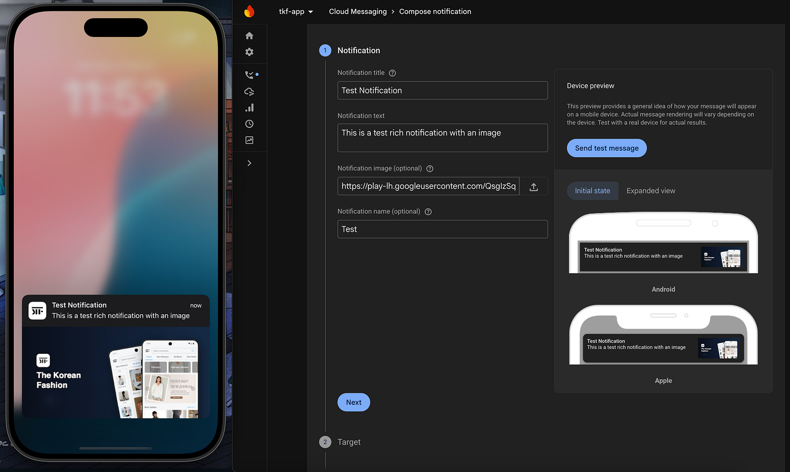

Push notifications on Android can display images out of the box. iOS is a different story. If you send a Firebase notification with an image URL, iOS will just ignore it unless you set up a Notification Service Extension to intercept and download that image before the notification is displayed.

This guide walks through the full setup in an Expo React Native project using Firebase Cloud Messaging (FCM). You'll need a development build for this, Expo Go won't work.

## Why a Notification Service Extension?

iOS doesn't automatically download remote images for push notifications. Instead, it gives you a small window of time (about 30 seconds) to modify the notification content before it shows up. A Notification Service Extension is a separate process that runs in the background, intercepts incoming notifications, downloads the image, and attaches it. Without it, your image URL just gets ignored.

## Step 1: Install the Apple Targets Plugin

You need [`@bacons/apple-targets`](https://github.com/EvanBacon/expo-apple-targets), a config plugin that lets you add native iOS targets (like a Notification Service Extension) to your Expo project without ejecting.

```bash
npx expo install @bacons/apple-targets
```

Then add the plugin to your `app.json`:

```json
{
  "expo": {
    "plugins": ["@bacons/apple-targets"]
  }
}
```

## Step 2: Create the Notification Service Target

Run the target creation command:

```bash
npx create-target
```

You'll see a list of available targets. Use the arrow keys to scroll down and select **Notification Service**, then press Return.

```
? Choose a target: › - Use arrow-keys. Return to submit.
    Network Extension: App Proxy
    Network Extension: DNS Proxy
    Network Extension: Filter Data
    Network Extension: Tunnel Provider
    Notification Content
❯   Notification Service
    Photo Editing
    Print Service
    Quick Look Preview
    Quicklook Thumbnail
```

This generates a `targets/notification-service/` directory in your project with the boilerplate files. These files should be committed to version control.

## Step 3: Replace the Swift Code

Open the generated `NotificationService.swift` file inside `targets/notification-service/` and replace its contents with the following. This code intercepts incoming notifications, checks for an image URL in FCM's `fcm_options.image` field, downloads it, and attaches it to the notification:

```swift
import UserNotifications

class NotificationService: UNNotificationServiceExtension {
  var contentHandler: ((UNNotificationContent) -> Void)?
  var bestAttemptContent: UNMutableNotificationContent?

  override func didReceive(
    _ request: UNNotificationRequest,
    withContentHandler contentHandler: @escaping (UNNotificationContent) -> Void
  ) {
    self.contentHandler = contentHandler
    bestAttemptContent =
      (request.content.mutableCopy() as? UNMutableNotificationContent)

    if let bestAttemptContent = bestAttemptContent {
      let userInfo = request.content.userInfo
      var imageUrlString: String?

      // FCM sends the image URL inside fcm_options.image
      if let fcmOptions = userInfo["fcm_options"] as? [String: Any],
        let image = fcmOptions["image"] as? String
      {
        imageUrlString = image
      }

      if let urlString = imageUrlString, let imageUrl = URL(string: urlString) {
        downloadAndAttachImage(url: imageUrl, to: bestAttemptContent) { content in
          contentHandler(content)
        }
      } else {
        contentHandler(bestAttemptContent)
      }
    }
  }

  private func downloadAndAttachImage(
    url: URL,
    to content: UNMutableNotificationContent,
    completion: @escaping (UNNotificationContent) -> Void
  ) {
    let task = URLSession.shared.downloadTask(with: url) {
      temporaryFileLocation, _, error in
      guard let temporaryFileLocation = temporaryFileLocation else {
        completion(content)
        return
      }

      let fileManager = FileManager.default
      let tempDirectory = URL(fileURLWithPath: NSTemporaryDirectory())
      let targetFileName = temporaryFileLocation.lastPathComponent + ".jpg"
      let targetUrl = tempDirectory.appendingPathComponent(targetFileName)

      try? fileManager.removeItem(at: targetUrl)

      do {
        try fileManager.moveItem(at: temporaryFileLocation, to: targetUrl)

        let attachment = try UNNotificationAttachment(
          identifier: "image",
          url: targetUrl,
          options: nil
        )

        content.attachments = [attachment]
      } catch {
        print("Error processing attachment: \(error.localizedDescription)")
      }

      completion(content)
    }

    task.resume()
  }

  override func serviceExtensionTimeWillExpire() {
    if let contentHandler = contentHandler,
      let bestAttemptContent = bestAttemptContent
    {
      contentHandler(bestAttemptContent)
    }
  }
}
```

A few things worth noting in this code:

- **`didReceive`** is called when iOS intercepts a push notification. It grabs the mutable copy of the content so we can modify it.
- **`fcm_options.image`** is where Firebase sends the image URL. This is specific to FCM payloads.
- **`downloadAndAttachImage`** downloads the image to a temp file, renames it with a `.jpg` extension (iOS needs a recognizable file extension), and creates a `UNNotificationAttachment`.
- **`serviceExtensionTimeWillExpire`** is the fallback. If the download takes too long, iOS calls this so the notification still shows, just without the image.

## Step 4: Set Your Apple Team ID

The Notification Service Extension needs to be signed with the same Apple Developer team as your main app. Add your Apple Team ID to `app.json` under the `ios` config:

```json
{
  "expo": {
    "ios": {
      "appleTeamId": "YOUR_APPLE_TEAM_ID"
    }
  }
}
```

Replace `YOUR_APPLE_TEAM_ID` with your actual Team ID from your [Apple Developer account](https://developer.apple.com/account). You can find it under Membership details.

If you prefer, you can also set this directly in Xcode by selecting the notification service target and configuring the Team under **Signing & Capabilities**.

## Step 5: Clean Build and Test

After making these changes, you need a clean build. Cached builds won't pick up the new target.

```bash
# Clean and rebuild
npx expo prebuild --clean
npx expo run:ios
```

Or if you're using EAS:

```bash
eas build --platform ios --profile development
```

To test, send a notification from your Firebase console or backend with an `image` field in the notification payload:

```json
{
  "message": {
    "token": "device-fcm-token",
    "notification": {
      "title": "Check this out",
      "body": "Here's an image notification",
      "image": "https://example.com/photo.jpg"
    }
  }
}
```

The image should appear in the notification on your iOS device.



## Common Gotchas

- **This only works with remote notifications.** Local notifications don't go through the Notification Service Extension.
- **Expo Go doesn't support this.** You need a development build since this requires native code.
- **Image size matters.** iOS has limits on notification attachment sizes. Keep images reasonable, under 10MB for images.
- **The extension has limited memory.** It runs in a separate process with a tight memory budget. Downloading very large files can cause it to be killed by the system.
- **APNs `mutable-content` flag must be set.** FCM handles this automatically when you include an image URL, but if you're crafting raw APNs payloads, make sure `mutable-content: 1` is in the `aps` dictionary.

## Wrapping Up

The setup is straightforward once you know the pieces: a config plugin for the target, a small Swift file for the download logic, and a clean rebuild. Android handles rich notifications automatically, but iOS needs this extra step. The good news is you only set it up once, and every image notification just works after that.

For more context, check out the [expo-apple-targets](https://github.com/EvanBacon/expo-apple-targets) repo and the related [Expo PR](https://github.com/expo/expo/pull/36202) that showcases this approach.
